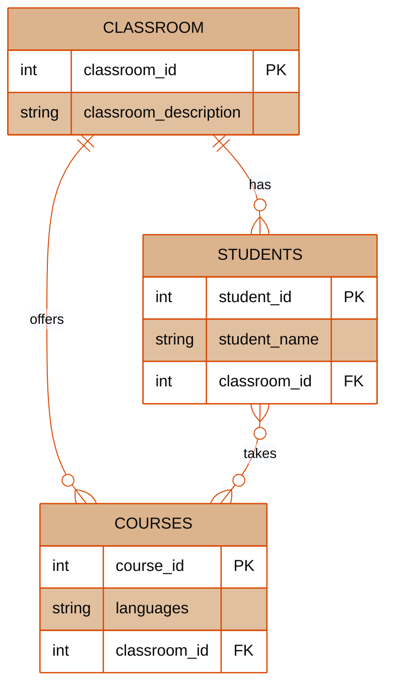

# db-normalization

### Google Sheet
[Normalization chart](https://docs.google.com/spreadsheets/d/10Yw1332MEDziovvPmbA9k7eY8Vcse30_Qm9orzXNUWU/edit?gid=0#gid=0)

### Chen diagram

### Database Schema

